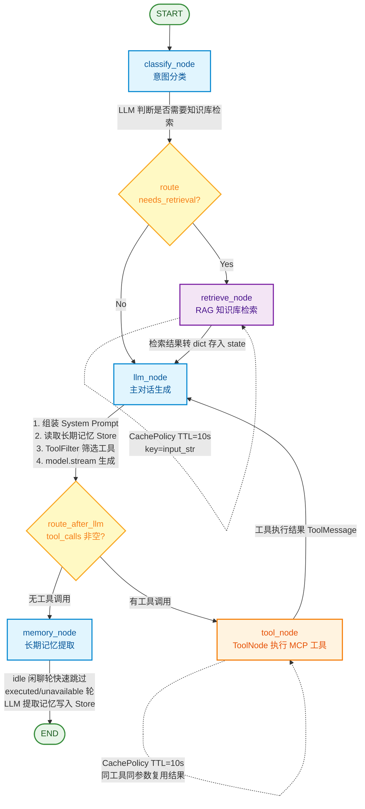
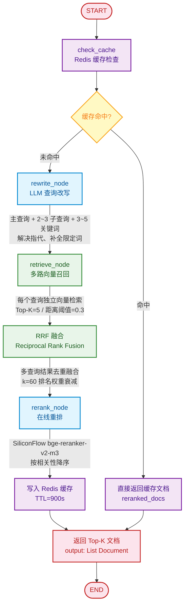

# Mitta AI 流程图

## 1. 主对话图（main_graph）

### 节点说明

| 节点                | 职责                | 关键实现                                                                                                                |
| ----------------- | ----------------- | ------------------------------------------------------------------------------------------------------------------- |
| **classify_node** | LLM 判断问题是否需要知识库检索 | `model.invoke([CLASSIFIER_PROMPT, user_input])`，返回 yes/no                                                           |
| **retrieve_node** | 调用 RAG 子图检索知识库    | `retrieve_graph.invoke()`，Document 转 dict 存入 state（checkpoint 反序列化兼容）                                               |
| **llm_node**      | 核心生成节点            | 组装 System Prompt（默认+用户自定义+长期记忆）→ ToolFilter 筛选工具 → `model.bind_tools()` → `model.stream()` → 合并 chunk 提取 tool_calls |
| **tool_node**     | 执行 MCP 工具         | LangGraph `ToolNode`，按工具名路由；CachePolicy 缓存同参数结果                                                                     |
| **memory_node**   | 提取长期记忆            | LLM 从对话中提取用户档案写入 PostgresStore；idle 闲聊轮快速跳过避免阻塞 SSE                                                                 |

### 条件路由

- **classify_node → route**：`needs_retrieval=True` 走检索链路，否则直接到 llm_node
- **llm_node → route_after_llm**：`tool_calls` 非空走 tool_node，否则走 memory_node
- **tool_node → llm_node**：工具执行结果回到 LLM 生成最终回答（可多轮循环）

---

## 2. RAG 检索子图（retrieve_graph）

### 节点说明

| 节点                | 职责           | 关键实现                                                               |
| ----------------- | ------------ | ------------------------------------------------------------------ |
| **check_cache**   | Redis 检索缓存检查 | `cache_service.query_cache(thread_id, question)`，LSH 快速过滤 + 向量重排验证 |
| **rewrite_node**  | LLM 查询改写     | 输出 JSON：`{主查询, 子查询[], 关键词[]}`，解决多轮指代问题                             |
| **retrieve_node** | 多路向量召回       | 每个改写查询独立检索 Milvus/ChromaDB，Top-K=5，cosine distance < 0.3           |
| **RRF 融合**        | 多查询结果融合      | Reciprocal Rank Fusion（k=60），按排名融合去重，避免单查询偏差                       |
| **rerank_node**   | 在线重排         | SiliconFlow `BAAI/bge-reranker-v2-m3`，按 relevance_score 降序取 Top-N  |
| **cache_write**   | 写入 Redis     | 缓存键 `retrieve_cache:{thread_id}:{bucket_id}`，TTL=900 秒             |

### 关键参数

| 参数                 | 值                       | 位置                                |
| ------------------ | ----------------------- | --------------------------------- |
| TOP_K              | 5                       | `constant/retrieval_constants.py` |
| DISTANCE_THRESHOLD | 0.3（cosine distance）    | `constant/retrieval_constants.py` |
| RRF_K              | 60                      | `constant/retrieval_constants.py` |
| 缓存 TTL             | 900 秒                   | `constant/cache_constant.py`      |
| Embedding 模型       | BAAI/bge-m3（1024 维）     | `constant/embedding_constants.py` |
| 重排模型               | BAAI/bge-reranker-v2-m3 | `init.py`                         |
